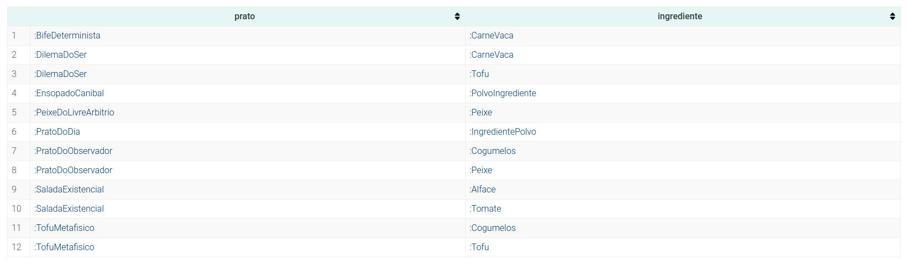

# TPC3 - Querrys Sparql

# Alterações à Ontologia

- Aristóteles não pode comer prato com polvo, por isso não come ensopado nem prato do dia
- 

# Queries

1. Quem foram os clientes?

Query

```sparql
SELECT ?cliente
WHERE {
  ?cliente rdf:type :Cliente .
}
    order by ?nome
```

Lista de Clientes:

```text
1 :Ana
2 :Bruno
3 :Carla
4 :Daniel
5 :Eva
6 :Schrodinger
```

1. Que pratos serve o restaurante?

Query

```sparql
SELECT ?prato
WHERE {
  ?prato rdf:type :Prato .
}
```

Lista de Pratos :

```text
1 :PratoDoDia
2 :SaladaExistencial
3 :TofuMetafisico
4 :BifeDeterminista
5 :PeixeDoLivreArbitrio
6 :PratoDoObservador
7 :DilemaDoSer
8 :EnsopadoCanibal
```

1. Quais os ingredientes necessários à confeção dos pratos?

Query

```sparql
PREFIX : <http://example.org/polvo-filosofico#>
PREFIX rdf: <http://www.w3.org/1999/02/22-rdf-syntax-ns#>
select DISTINCT ?ing where {
    ?s rdf:type :Prato;
       :temIngrediente ?ing .
}
```



1. Há funcionários que também sejam clientes?

Query

```sparql
SELECT ?pessoa
WHERE {
  ?pessoa rdf:type :Funcionario .
  ?pessoa rdf:type :Cliente .
}
```

Lista de Funcionários que também são clientes obtida:

```text
1 :Schrodinger
```